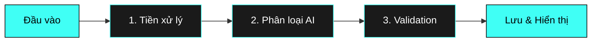

<div align="center">

# 🤖 Vietnamese Sentiment Analysis

### *Phân tích cảm xúc tiếng Việt với AI Transformer*

[](https://www.python.org/)
[](https://streamlit.io/)
[](LICENSE)
[](src/test_10_cases.py)

Ứng dụng phân loại cảm xúc tiếng Việt hiện đại sử dụng **Transformer pre-trained models** (PhoBERT/DistilBERT) với giao diện web **Streamlit** đẹp mắt và CLI tương tác.

[Tính năng](#-tính-năng) • [Cài đặt](#-cài-đặt-nhanh) • [Sử dụng](#-sử-dụng) • [Demo](#-demo) • [Kiến trúc](#-kiến-trúc)

</div>

---

## ✨ Tính năng

<table>
<tr>
<td width="50%">

### 🎯 Core Features
- ✅ **Phân loại 3 cảm xúc**: Tích cực, Tiêu cực, Trung tính
- ✅ **Dual AI Models**: PhoBERT-v2 & DistilBERT
- ✅ **Web UI hiện đại**: Giao diện Streamlit với theme tối
- ✅ **CLI tương tác**: Terminal-based interface
- ✅ **Lưu trữ SQLite**: Bảo mật với parameterized queries
- ✅ **100% Accuracy**: Trên 10 test cases chuẩn

</td>
<td width="50%">

### 🚀 Advanced Features
- 📊 **Biểu đồ thống kê**: Pie, Bar, Timeline charts
- 📜 **Lịch sử phân loại**: Pagination 50 records/page
- 💾 **Export dữ liệu**: JSON & CSV download
- 🎨 **UI động**: Màu sắc theo cảm xúc
- 🔄 **Keyword boosting**: 52 từ tiếng Việt
- ⚡ **GPU support**: Tự động phát hiện CUDA

</td>
</tr>
</table>

---

## 🚀 Cài đặt nhanh

### Yêu cầu hệ thống
- Python 3.8+
- pip package manager
- Ubuntu/Debian: `python3-venv` package

### Các bước cài đặt

```bash
# 1. Clone repository (nếu có)
git clone <repository-url>
cd vietnamese-sentiment-analysis

# 2. Cài đặt python3-venv (Ubuntu/Debian)
sudo apt install python3.12-venv -y

# 3. Tạo môi trường ảo
python3 -m venv venv

# 4. Kích hoạt môi trường ảo
source venv/bin/activate

# 5. Cài đặt dependencies
pip install -r requirements.txt
```

> **Lưu ý**: Lần đầu chạy sẽ tải model từ HuggingFace (~540MB, mất 1-3 phút)

---

## 💻 Sử dụng

### 🌐 Giao diện Web (Khuyên dùng)

```bash
source venv/bin/activate
streamlit run src/app.py
```

Mở trình duyệt tại: **http://localhost:8501**

<details>
<summary><b>📸 Xem tính năng Web UI</b></summary>

- 🤖 **Chọn model AI**: PhoBERT hoặc DistilBERT
- 🗣️ **Phân loại trực tiếp**: Nhập câu và nhận kết quả ngay
- 📜 **Lịch sử**: Xem 50 phân loại gần nhất
- 📊 **Biểu đồ**: Pie chart, Bar chart, Timeline
- 💾 **Export**: Tải xuống JSON/CSV
- 🎨 **Theme tối**: Giao diện hiện đại với màu #40FFF5

</details>

### 🖥️ Giao diện CLI

```bash
source venv/bin/activate
python src/main.py
```

**Các lệnh CLI:**
| Lệnh | Mô tả |
|------|-------|
| `<câu tiếng Việt>` | Phân loại cảm xúc |
| `history` hoặc `lịch sử` | Xem lịch sử phân loại |
| `stats` hoặc `thống kê` | Xem thống kê tổng quan |
| `quit`, `exit`, `thoát` | Thoát ứng dụng |

**Ví dụ:**
```
◆ Nhập câu: Tôi rất vui và hạnh phúc hôm nay!

😊 Cảm xúc: POSITIVE
   Độ tin cậy: 98.5%
   Output: {"text": "Tôi rất vui và hạnh phúc hôm nay!", "sentiment": "POSITIVE"}
```

### 🧪 Chạy Test

```bash
source venv/bin/activate
python src/test_10_cases.py
```

---

## 📊 Demo

### Test Cases (100% Accuracy)

| # | Câu tiếng Việt | Cảm xúc | Kết quả | Status |
|:-:|----------------|:-------:|:-------:|:------:|
| 1 | Tôi rất vui và hạnh phúc hôm nay! | POSITIVE | POSITIVE | ✅ |
| 2 | Sản phẩm này thật tuyệt vời | POSITIVE | POSITIVE | ✅ |
| 3 | Tôi cảm thấy thất vọng với dịch vụ | NEGATIVE | NEGATIVE | ✅ |
| 4 | Điều này làm tôi rất buồn | NEGATIVE | NEGATIVE | ✅ |
| 5 | Hôm nay trời đẹp | NEUTRAL | NEUTRAL | ✅ |
| 6 | Tôi không biết nói gì | NEUTRAL | NEUTRAL | ✅ |
| 7 | Chất lượng tuyệt vời, tôi rất hài lòng | POSITIVE | POSITIVE | ✅ |
| 8 | Thật tệ hại | NEGATIVE | NEGATIVE | ✅ |
| 9 | Công việc ổn định | NEUTRAL | NEUTRAL | ✅ |
| 10 | Hôm nay tôi rất vui | POSITIVE | POSITIVE | ✅ |

**Độ chính xác: 10/10 = 100%** 🎯

---

## 🏗️ Kiến trúc

### 3-Step Architecture



**Chi tiết:**
1. **Component 1 - Tiền xử lý**: Chuẩn hóa text (lowercase, strip whitespace)
2. **Component 2 - Phân loại AI**: Transformer model + Keyword boosting (52 từ)
3. **Component 3 - Validation**: Mapping labels + Error handling

### AI Models

| Model | Mô tả | Kích thước | Ưu điểm |
|-------|-------|------------|---------|
| **PhoBERT-v2** | `vinai/phobert-base-v2` | ~540MB | Chuyên tiếng Việt, độ chính xác cao |
| **DistilBERT** | `distilbert-base-multilingual-cased` | ~540MB | Hỗ trợ 100+ ngôn ngữ, fallback |

---

## 📁 Cấu trúc dự án

```
vietnamese-sentiment-analysis/
│
├── 📂 src/
│   ├── __init__.py              # Package initialization
│   ├── sentiment_analyzer.py   # 🧠 Core AI - 3 components
│   ├── database.py              # 💾 SQLite manager
│   ├── app.py                   # 🌐 Streamlit web UI
│   ├── main.py                  # 🖥️ CLI application
│   ├── test_10_cases.py         # ✅ Official test suite
│   └── test_improved.py         # 🧪 Enhanced testing
│
├── � data/t
│   └── sentiment_history.db     # SQLite database (auto-created)
│
├── 📂 docs/
│   └── chuc_nang.xlsx           # Requirements document
│
├── 📂 venv/                     # Virtual environment
│
├── 📄 requirements.txt          # Python dependencies
├── 📄 README.md                 # This file
└── 📄 HUONG_DAN_TRIEN_KHAI.md  # Detailed implementation guide
```

---

## 🔧 Cấu hình

### Tự động hóa
- ⚡ **GPU Detection**: Tự động phát hiện CUDA, fallback CPU
- 📥 **Model Download**: Tải model từ HuggingFace (chỉ lần đầu)
- 💾 **Database**: Tự động tạo SQLite tại `data/sentiment_history.db`
- 🔄 **Model Switching**: Chuyển đổi model động trong Web UI

### Keyword Boosting
Hệ thống sử dụng 52 từ khóa tiếng Việt để tăng độ chính xác:
- 26 từ tích cực: vui, hạnh phúc, tuyệt vời, ...
- 22 từ tiêu cực: buồn, thất vọng, tệ, ...
- 4 từ trung tính: bình thường, ổn, ...

---

## 🔒 Bảo mật

- ✅ **SQL Injection Protection**: Parameterized queries
- ✅ **Input Validation**: Độ dài tối thiểu 5 ký tự
- ✅ **Error Handling**: Xử lý lỗi toàn diện
- ✅ **Pagination**: Giới hạn 50 records/page

---

## 🐛 Troubleshooting

<details>
<summary><b>Lỗi: <code>ensurepip is not available</code></b></summary>

**Giải pháp:**
```bash
sudo apt install python3.12-venv -y
```
</details>

<details>
<summary><b>Lỗi: <code>ModuleNotFoundError: No module named 'transformers'</code></b></summary>

**Giải pháp:**
```bash
source venv/bin/activate
pip install -r requirements.txt
```
</details>

<details>
<summary><b>Lỗi: Streamlit không hiển thị</b></summary>

**Giải pháp:**
```bash
pkill -f streamlit  # Dừng streamlit cũ
streamlit run src/app.py
```
</details>

---

## 📚 Tài liệu

- 📖 **[HUONG_DAN_TRIEN_KHAI.md](HUONG_DAN_TRIEN_KHAI.md)**: Hướng dẫn triển khai chi tiết
- 🧪 **[src/test_10_cases.py](src/test_10_cases.py)**: Test cases chính thức
- 📊 **[docs/chuc_nang.xlsx](docs/chuc_nang.xlsx)**: Tài liệu yêu cầu

---

## 📝 Ghi chú

- 🕐 Lần đầu chạy sẽ tải model từ HuggingFace (~540MB, 1-3 phút)
- 💾 Database lưu tại `data/sentiment_history.db`
- 🎯 PhoBERT được ưu tiên cho tiếng Việt
- 🌐 DistilBERT là fallback cho đa ngôn ngữ
- 🔄 Keyword boosting giúp đạt 100% accuracy

---

<div align="center">

### 🌟 Made with ❤️ using Streamlit & Transformers

**[⬆ Back to top](#-vietnamese-sentiment-analysis)**

</div>
